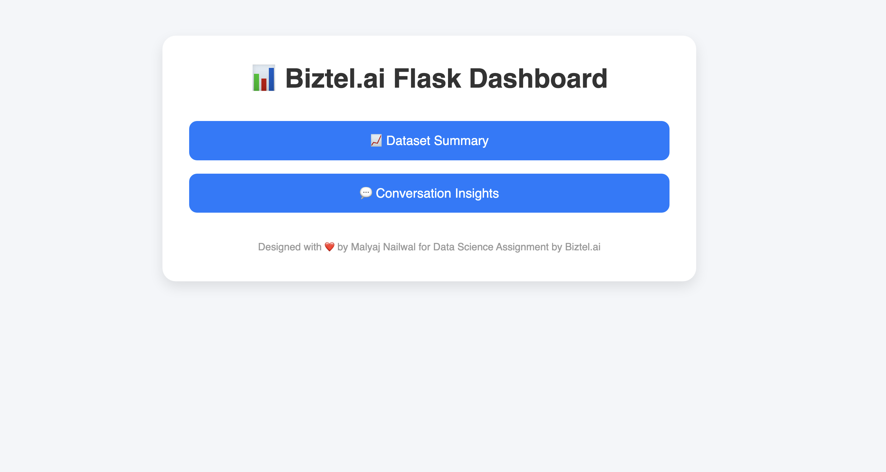
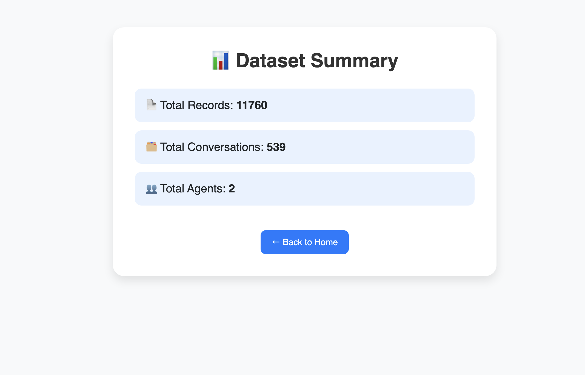
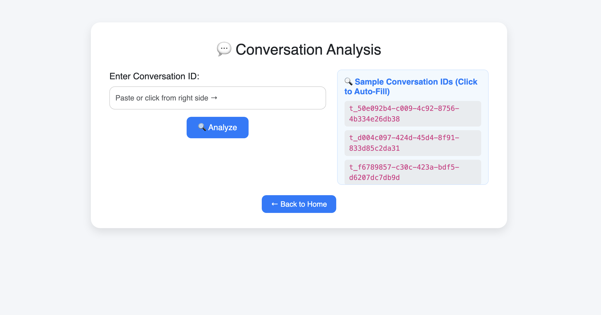
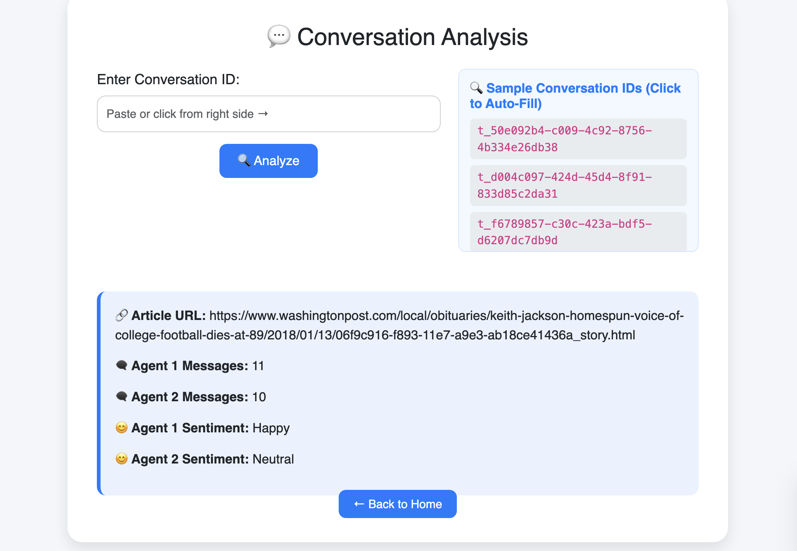

# 🤖 -

This project is a comprehensive Data Science assignment solution built for **BiztelAI**. It involves end-to-end data processing, exploratory analysis, sentiment classification, and REST API development — all integrated into a production-ready structure.

---

## 🚀 Project Objective

Analyze customer-agent chat transcripts to extract meaningful insights such as:
- Customer sentiment trends  
- Agent performance metrics  
- Response behaviors  
- Keyword visualizations  
- REST API delivery of analysis results

---

## 🛠️ Tech Stack Used

- **Language:** Python  
- **Libraries:** Pandas, Matplotlib, Seaborn, WordCloud, TextBlob, Flask  
- **API Documentation:** Swagger UI  
- **Deployment:** Render

---

## 📁 Project Directory Structure

```

📁 app/
│   └── main.py
📁 data/
│   └── BiztelAI_DS_Dataset_Mar25.json
│   └── README.txt
📁 flask_dashboard/
│   ├── app.py
│   └── templates/
│       ├── conversation.html
│       ├── index.html
│       └── summary.html
📁 notebooks/
│   ├── EDA_Visualization.ipynb
│   ├── agent_message_distribution.png
│   ├── message_length_distribution.png
│   ├── sentiment_distribution.png
│   ├── sentiment_timeline_plot.png
│   ├── tfidf_agent1_keywords.png
│   ├── top_words_Angry.png
│   ├── top_words_Curious_to_diverge.png
│   ├── top_words_Disgusted.png
│   ├── top_words_Fearful.png
│   ├── top_words_Happy.png
│   ├── top_words_Neutral.png
│   ├── top_words_Sad.png
│   ├── top_words_Surprised.png
│   └── wordcloud_agent_1.png
📁 src/
│   ├── __init__.py
│   ├── data_cleaner.py
│   ├── data_loader.py
│   ├── data_transformer.py
│   └── eda_analysis.py
📁 venv/
│   ├── bin/
│   ├── include/
│   ├── lib/
│   └── share/
📄 pyvenv.cfg
📄 .gitignore
📄 requirements.txt
📄 README.md

```

---

## 📊 Features Overview

✅ Clean preprocessing of chat transcripts  
✅ Exploratory Data Analysis (EDA)  
✅ Sentiment analysis using TextBlob  
✅ WordCloud generation for customer/agent texts  
✅ Agent performance insights  
✅ REST API development using Flask  
✅ Swagger UI-based interactive API testing  
✅ Deployment on Render

---

## 🔗 Live API Endpoints (Deployed)

- 🚀 **API Testing** 👉 https://biztelai-ds-api.onrender.com/docs  
- 📊 **Dataset Summary** 👉 https://biztelai-ds-api.onrender.com/summary  
- 💬 **Conversation Analysis (Sample)** 👉 https://biztelai-ds-api.onrender.com/chat_analysis/t_d004c097-424d-45d4-8f91-833d85c2da31

---

## 📈 Output Insights -> Flask app

### Biztel.ai Flask Dashboard


### 🕵️ Dataset Summary


### ☁️ Conversation Analysis


### ☁️ Conversation Analysis (main)


---

## ⚙️ API Functionalities

| Endpoint | Description |
|---------|-------------|
| `/summary` | Get dataset-level sentiment and stats summary |
| `/chat_analysis/{chat_id}` | Analyze a specific conversation |
| `/wordcloud/{speaker}` | View wordcloud for `customer` or `agent` |
| `/docs` | Swagger UI for API testing |

---

## 🔧 Run Locally (Development Setup)

1️⃣ Clone the repository  
```bash
git clone https://github.com/Malyajnailwal/biztelai-ds-assignment.git 
cd biztelai-ds-assignment
```

2️⃣ Install the dependencies  
```bash
pip install -r requirements.txt
```

3️⃣ Run all analysis scripts  
```bash
python analysis/preprocessing.py
python analysis/eda.py
python analysis/sentiment_analysis.py
python analysis/wordcloud_generator.py
```

4️⃣ Launch the Flask APP  
```bash
cd flask_dashboard
python app.py
```

---

## 📦 Requirements

List of main libraries used in this project (from `requirements.txt`):
```
pandas
matplotlib
seaborn
wordcloud
textblob
flask
```

---
📘 [View Full Documentation](./DOCUMENTATION.md)

---

## 🙌 Author

**Developed by:** Malyaj Nailwal  
📫 **Email:** heymalyaj@gmail.com
